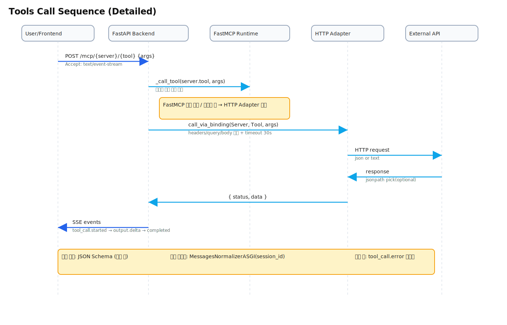

## MCP Hub

간단한 대시보드(UI)에서 외부 REST API들을 서버/툴 바인딩으로 등록하고, SSE 기반으로 툴을 호출해 결과를 스트리밍으로 받는 MVP입니다. 백엔드는 FastAPI + FastMCP 런타임, 프런트는 React(Vite)로 구성됩니다.

### 핵심 개념 요약
- **ServerConfig**: 외부 API 서버의 `baseUrl`, `auth`, `defaultHeaders`, `active` 등을 보유
- **ToolBinding**: 하나의 툴이 어떤 HTTP 메서드/경로/파라미터 매핑으로 호출될지를 정의
- **InMemoryRegistry**: 서버/툴 설정을 메모리에 저장·조회
- **FastMCP 런타임 연동**: 등록된 툴을 FastMCP에 등록해 표준 SSE 메시지 흐름으로 호출 가능
- **HTTP Adapter**: 바인딩 정보를 이용해 실제 외부 API를 호출하고 응답을 후처리(JSONPath pick 등) 

---

## 아키텍처 개요


### 툴 호출 시퀀스 (tools.call)


### 텍스트 다이어그램(ASCII)

아키텍처(구성도)

```text
+------------------------------+
| Frontend (React/Vite)        |
|  - Dashboard UI              |
|  - Proxy /api,/mcp -> 8000   |
+--------------+---------------+
               | REST / SSE
               v
+-------------------------------------------------------------+
| Backend (FastAPI)                                           |
| + Lifespan: 기본 서버/툴 자동 등록, 서버별 SSE 마운트        |
| + CORS: * (methods/headers 모두 허용)                        |
|                                                             |
| Routers:                                                    |
|  - /api/*      (Servers/Tools CRUD, Stats)                  |
|  - /mcp/*      (tools.call SSE, base/compat)                |
|  - /mcp-sdk/*  (Global FastMCP SSE; MessagesNormalizerASGI) |
|  - /_dev/*     (seed/test)                                  |
|                                                             |
| Services:                                                   |
|  - InMemoryRegistry (servers/tools, stats)                  |
|  - FastMCP Runtime (global & per-server)                    |
|  - HTTP Adapter (URL/Headers/Query/Body 구성, jsonpath pick)|
+------------------------------+------------------------------+
                               |
                               v
+------------------------------+
| External REST APIs           |
| FakeStore, Fruits, httpbin...|
+------------------------------+
```

툴 호출 시퀀스

```text
1) UI → BE: POST /mcp/{serverId}/{toolName} {args}
   - headers: Accept: text/event-stream
2) BE: (가능 시) JSON Schema로 args 검증
3) BE → FastMCP: _call_tool(serverId.toolName, args)
   - 성공 시: FastMCP 결과를 구조화(텍스트/구조 데이터)
4) (폴백) FastMCP 실패/미등록 시 → HTTP Adapter 호출
   - call_via_binding(ServerConfig, ToolBinding, args)
   - 외부 API HTTP 요청(method/url/headers/query/body)
   - 응답(JSON/텍스트) 수신 → jsonpath pick(optional)
5) BE → UI (SSE 스트림):
   - event: tool_call.started
   - event: output.delta (payload)
   - event: tool_call.completed {status}
   - error 시: tool_call.error

참고)
- ensure_server_mounted(server): /mcp-servers/{server}에 서버 스코프 SSE 서브앱 동적 마운트
- /mcp-sdk 하위 SSE는 MessagesNormalizerASGI로 session_id 정규화 지원
```

### 부팅 시 동작(lifespan)
- 앱 시작 시 `fakestore_api`/`fruits_api` 서버 및 대표 툴들을 자동 등록(이미 있으면 스킵)
- 서버별 FastMCP SSE 서브앱을 `/_app.mount("/mcp-servers/{server}")`로 동적 마운트
- 글로벌 FastMCP SSE 앱은 `/mcp-sdk` 경로에 마운트

---

## 디렉터리 구조
```
backend/
  app/
    main.py                # FastAPI 엔트리, 라우터/미들웨어/수명 주기
    http_adapter.py        # ToolBinding→HTTP 요청 변환/호출
    fastmcp_runtime.py     # FastMCP 등록/호출, SSE 서브앱 빌드/마운트
    registry.py            # 인메모리 레지스트리
    models.py              # Pydantic 모델 (ServerConfig, ToolBinding 등)
    routes_api.py          # /api/* CRUD 및 통계
    routes_mcp.py          # /mcp/* tools.call, SSE 응답
    routes_mcp_meta.py     # MCP 초기화/메타 인터페이스
    routes_dev.py          # 개발용 시드/테스트 엔드포인트

frontend/
  src/
    App.tsx               # 대시보드 UI (Servers/Tools 관리/테스트)
    main.tsx              # 프런트 엔트리
    components/ui/*       # UI 컴포넌트(shadcn 스타일)
    lib/utils.ts          # 클래스 병합 유틸
  vite.config.ts          # 개발 프록시(/api, /mcp → 127.0.0.1:8000)

docker-compose.yml        # 백엔드/프런트 컨테이너 오케스트레이션
DOCKER.md                 # 도커 실행 가이드
```

---

## 실행 방법

### 1) Docker (권장)
사전 요구: Docker, Docker Compose

```bash
docker compose build
docker compose up -d

# 상태 확인
curl http://localhost:8000/healthz
open http://localhost:8000/docs
open http://localhost:5173
```

컨테이너/포트
- 백엔드(uvicorn): `localhost:8000`
- 프런트(Nginx): `localhost:5173`

로그/정지
```bash
docker compose logs -f backend
docker compose logs -f frontend
docker compose down
```

추가 내용은 `DOCKER.md` 참고.

### 2) 로컬 개발 (Docker 없이)
사전 요구: Python 3.11+, Node 20+

백엔드
```bash
# 프로젝트 루트에서
python -m venv .venv
source .venv/bin/activate  # Windows: .venv\\Scripts\\activate
pip install -r requirements.txt

# FastAPI 서버 실행
uvicorn backend.app.main:app --reload --host 0.0.0.0 --port 8000
```

프런트엔드 (개발 프록시가 /api, /mcp를 127.0.0.1:8000으로 전달)
```bash
cd frontend
npm install
npm run dev
# http://localhost:5173
```

---

## 빠른 사용법

### 대시보드에서 서버/툴 등록
1) 프런트 `MCP Hub Dashboard` → Servers 탭에서 `+ Add Server`로 `name`, `baseUrl`, `auth`, `defaultHeaders` 입력 후 저장
2) Tools 탭에서 `+ Add Tool`로 `method`, `pathTemplate`, `paramMapping`, `inputSchema`, `response pick(JSONPath)` 설정 후 저장
3) `Test`로 해당 툴을 호출하면 SSE 스트림 로그가 모달에 표시

### 개발용 시드
```bash
# httpbin 시드
curl -X POST http://localhost:8000/_dev/seed/httpbin

# ipify 시드
curl -X POST http://localhost:8000/_dev/seed/ipify
```

### 헬스·통계
```bash
curl http://localhost:8000/healthz
curl http://localhost:8000/api/stats
```

### MCP 호환 엔드포인트(메타)
- `POST /mcp/initialize`, `POST /mcp/{server_id}/initialize`
- `GET/POST /mcp/{server_id}/tools/list`

---

## 주요 설계 포인트
- 바인딩 기반 호출: `ToolBinding`의 `pathTemplate`/`paramMapping`으로 안전하게 URL/헤더/쿼리/바디 구성
- 응답 후처리: `responseMapping.pick`이 있으면 `jsonpath-ng`로 원하는 부분만 추출하여 데이터 최소화
- FastMCP 우선: 등록된 툴은 FastMCP로 실행하고, 실패 시 HTTP Adapter 폴백
- 서버 스코프 SSE: `/mcp-servers/{server}`에 서버별 SSE 앱을 마운트해 클라이언트 격리

---

## 트러블슈팅
- 포트 충돌: 8000/5173 사용 중이면 해당 프로세스 종료 후 재시도
- 프런트 타입 에러: `npm run dev`에서 발생 시 `frontend/src` 수정, Docker는 `vite build`로 완화되어 있음
- 백엔드 의존성: `requirements.txt` 변경 후 다시 설치/리빌드
- SSE 응답이 비어있음: 대상 API 응답이 텍스트/빈 바디일 수 있음. `responseMapping.pick` 제거하고 원본 데이터를 확인

---

## 라이선스
MIT (필요 시 변경)


